## Indice
- [Actualización](#actualizacion)
- [Cargar usuarios csv](#cargarUsuariosCSV)
- [Acciones masivas CSV (Alternativa)](#accionesMaisivasCSV)
  * [Forzar cambio contraseña CSV](#forzarCambioContrasenaCSV)
  * [Eliminar usuarios CSV](#borradoMasivoUsers)
  * [Des-matricular usuarios CSV](#desMatricularUsuarioCSV)
  * [Cambiar tema de usuarios CSV ](#cambiarTemaUsuarioCSV)
  * [Borrar cursos CSV](#borrarCursosCSV)
- [No mostrar participantes de un curso a otros participantes](#noMostrarParticipantes)
- [Revisar usuarios que quedan en cache](#revisarCacheUsuarios)
- [Bibliografía y documentación](#bibliografia)


## <a name="actualizacion">Actualización</a>
Se actualizo el numero de ventas, el numero de soporte, el correo de soporte y
la dirección.

## <a name="cargarUsuariosCSV">Cargar usuarios por medio de un archivo CSV</a>
```
Página Principal > Administración del sitio > Usuarios > Cuentas > Subir usuarios
```
#### URL
[https://virtuales.comomanejo.com.co/admin/tool/uploaduser/index.php](https://virtuales.comomanejo.com.co/admin/tool/uploaduser/index.php)

Formato base usado por el archivo CSV recuerde colocar el encabezado con esto

> username;firstname;lastname;email

Formato si desea agregar otros campos personalizados que previamente ya fueron
agregados en campos de perfil del usuario otros campos.

[https://virtuales.comomanejo.com.co/user/profile/index.php](https://virtuales.comomanejo.com.co/user/profile/index.php)

> username;firstname;lastname;email;profile_field_xxxxx

>> donde xxxxx es el nombre corto del campo.

>> para el caso de empresa seria profile_field_Empresa y profile_field_Hoja para la hoja de ruta.

#### Archivo ejemplo
[listaUsuariosMasivos.csv](./listaUsuariosMasivos.csv)

#### Pasos
#### Paso 1


#### Paso 2
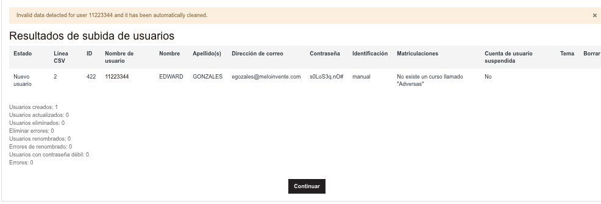

## <a name="accionesMaisivasCSV">Acciones masivas CSV (Alternativa)</a>
### <a name="forzarCambioContrasenaCSV">Forzar cambio de contraseña CSV</a>
Se puede forzar el cambio de contraseña de un grupo de usuarios por medio de un
archivo CSV.
```
Página Principal > Administración del sitio > Usuarios > Cuentas > Subir usuarios
```
#### URL
[https://virtuales.comomanejo.com.co/admin/tool/uploaduser/index.php](https://virtuales.comomanejo.com.co/admin/tool/uploaduser/index.php)

Formato usado por el archivo CSV recuerde colocar el encabezado con esto.

> username;password

>> username = Nombre de usuario de la plataforma

>> password = contraseña actual del usuario

#### Archivo ejemplo
[forzarCambioDePassword.csv](./forzarCambioDePassword.csv)

#### Pasos
#### Paso 1


#### Paso 2
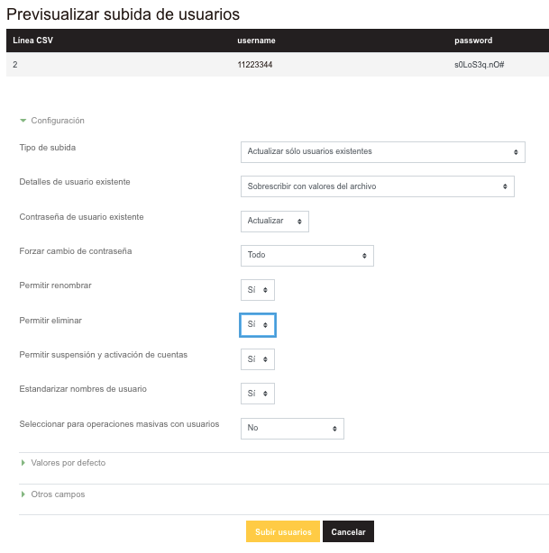

#### Paso 3


### <a name="borradoMasivoUsers">Eliminar usuarios CSV</a>
Se puede eliminar usuarios en este enlace se se sube un archivo CSV.

```
Página Principal > Administración del sitio > Usuarios > Cuentas > Subir usuarios
```
#### URL
[https://virtuales.comomanejo.com.co/admin/tool/uploaduser/index.php](https://virtuales.comomanejo.com.co/admin/tool/uploaduser/index.php)

Formato usado por el archivo CSV recuerde colocar el encabezado con esto.

> username;deleted

>> username = Nombre de usuario de la plataforma

>> deleted = 1 para borrar

#### Archivo ejemplo
[borradoMasivo.csv](./borradoMasivo.csv)

#### Pasos
#### Paso 1
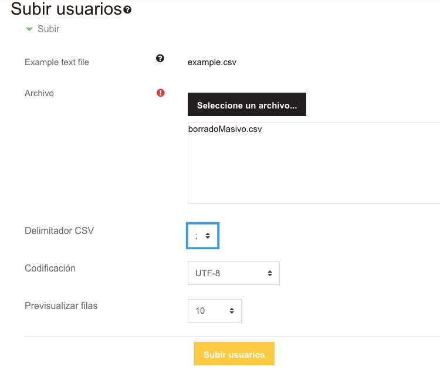

#### Paso 2
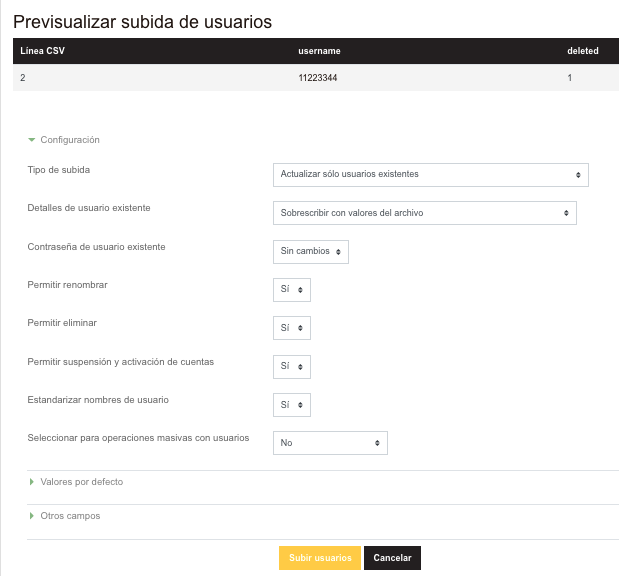

#### Paso 3
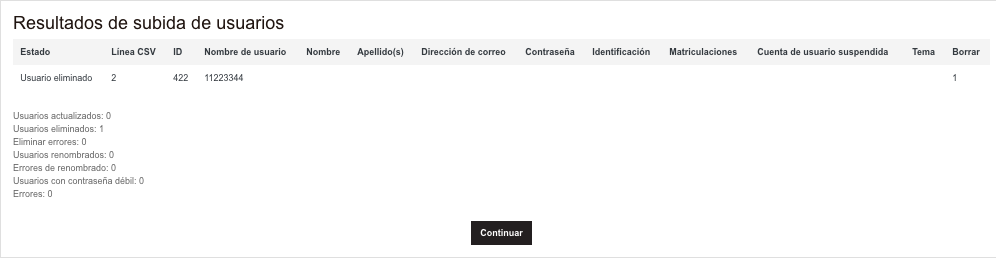

### <a name="desMatricularUsuarioCSV">Des-matricular usuarios CSV</a>


### <a name="cambiarTemaUsuarioCSV">Cambiar tema de usuarios CSV - no recomendado usar esta función ya que cambia la imagen corporativa del moodle para usuario</a>
Se puede cambiar el tema desde un archivo CSV

```
Página Principal > Administración del sitio > Usuarios > Cuentas > Subir usuarios
```

#### URL
[https://virtuales.comomanejo.com.co/admin/tool/uploaduser/index.php](https://virtuales.comomanejo.com.co/admin/tool/uploaduser/index.php)

Formato usado por el archivo CSV recuerde colocar el encabezado con esto.

> username;firstname;lastname;email;theme

>> theme = el tema puede ser cualquiera de los siguientes

>>> academi = el que contiene la imagen corporativa de comomanejo

>>> boost

>>> classic

#### Archivo ejemplo
[cambioTemaUsuario.csv](./cambioTemaUsuarios.csv)

#### Pasos
#### Paso 1
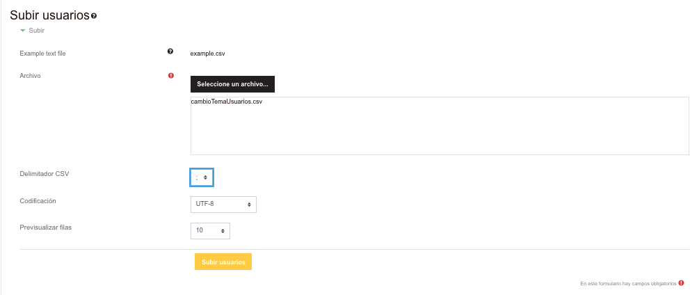

#### Paso 2
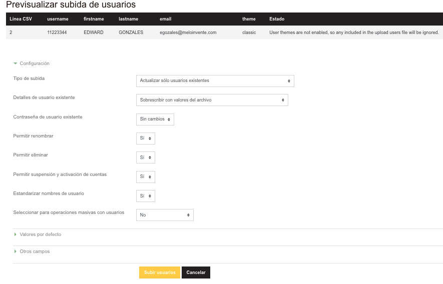

#### Paso 3 - se puede notar que no esta habilitado el cambio de tema para los usuarios


- [Si desea habilitar la opcion de cambio de tema modifique el "permitir estilos al usuario" - note la advertencia en la descripción](https://virtuales.comomanejo.com.co/admin/settings.php?section=themesettings)
- [Permitir temas del usuario](https://docs.moodle.org/all/es/Configuraci%C3%B3n_de_temas#Permitir_temas_del_usuario)

### <a name="borrarCursosCSV">Borrar cursos CSV</a>
Se puede eliminar cursos desde un archivo CSV

```
Página Principal > Administración del sitio > Cursos > Subir cursos
```

#### URL
[https://virtuales.comomanejo.com.co/admin/tool/uploadcourse/index.php](https://virtuales.comomanejo.com.co/admin/tool/uploadcourse/index.php)

Formato usado por el archivo CSV recuerde colocar el encabezado con esto
(este proceso durante la eliminación puede llevar tiempo paciencia).

> shortname;delete

>> shortname = nombre corto de curso

>> delete = 1 para borrar

#### Archivo ejemplo
[deleteCurso.csv](./deleteCurso.csv)

#### Pasos
#### Paso 1


#### Paso 2


## <a name="noMostrarParticipantes">No mostrar participantes de un curso a otros participantes</a>
Para ello al rol de estudiante se le modificaron los siguientes permisos.

### Url
[https://virtuales.comomanejo.com.co/admin/roles/define.php?action=edit&roleid=5](https://virtuales.comomanejo.com.co/admin/roles/define.php?action=edit&roleid=5)

Actual | Por defecto
--|--
 | Creador de curso, Profesor, Profesor sin permiso de edición, Estudiante
 | 
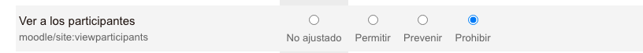 | 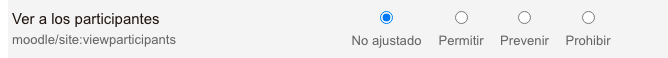
 | 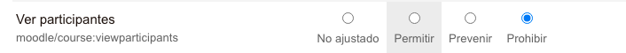
 | 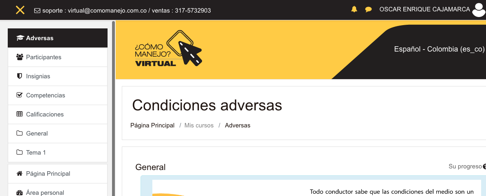

## <a name="revisarCacheUsuarios">Revisar usuarios que quedan en cache</a>
Se habla de eliminar los usuarios asociados a un curso cuando este se elimina,
algo que desde mi punto de vista no debe ser, ya que esos usuarios pueden estar
asociados a otros cursos y por eso mismo generar conflictos cuando se consulte
la información en otro curso (por ellos no se eliminan los usuarios).

- una solución es cargar un csv con los usuarios pertenecientes al curso que se
quiere eliminar [ver](#borradoMasivoUsers)

# <a name="bibliografia">Vea</a>
- [subir usuarios moodle 7.8 y 3.9](https://docs.moodle.org/all/es/38/Subir_usuarios#Archivo_de_subida_v.C3.A1lido_para_pruebas)
- [inscripción masiva (inscribir o des-inscribir) de usuarios existentes en cursos existentes mediante un archivo CSV](https://docs.moodle.org/all/es/Archivo_plano)
- [subir cursos moodle](https://docs.moodle.org/all/es/Subir_cursos)
